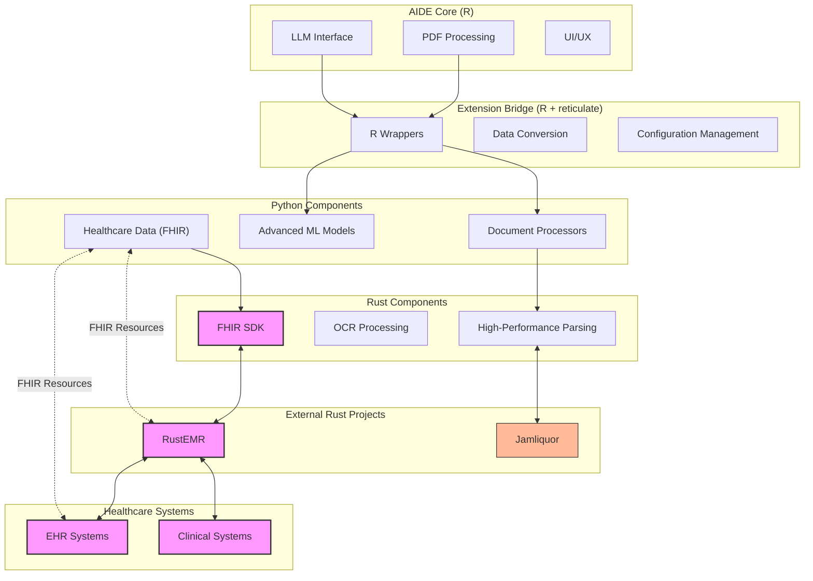

# AIDE Extensions: Polyglot Supercharger

This extension enhances the core AI-assisted Data Extraction (AIDE) R package with Python and Rust components to create a more powerful, versatile document processing and data extraction system focused on scientific literature and healthcare data.

## Vision

AIDE Extensions builds upon the strong statistical foundation of the R-based AIDE while incorporating:

- **Python's AI/ML ecosystem** for advanced document understanding and processing
- **Rust's performance benefits** for computationally intensive operations and healthcare data handling
- **R's statistical and data visualization strengths** for analysis and reporting

This polyglot approach allows AIDE to handle a broader range of document formats, extract more complex data structures, and process larger datasets while maintaining compatibility with the core AIDE functionality.

## Relationship with AIDE-R

AIDE-extension exists as a submodule to the main AIDE-R repository, enabling:

1. **Independent Development:** AIDE-extension can evolve at its own pace, with its own versioning and release cycle, while still maintaining a connection to the original AIDE-R codebase.

2. **Clear Boundaries:** The submodule structure provides a clean separation between the core AIDE-R functionality (focused on scientific literature extraction) and our enhanced capabilities (focused on healthcare data and advanced AI/ML).

3. **Complementary Strengths:** 
   - **AIDE-R** excels at systematic review and meta-analysis of academic literature using strong statistical methods.
   - **AIDE-extension** expands this to include healthcare-specific document processing, FHIR compliance, and integration with healthcare data systems.

4. **Combined Workflow:** Users can choose to use only AIDE-R for traditional academic extraction tasks, or leverage the combined power of both components for more advanced healthcare data science applications.

## Architecture

The extension uses a modular, language-appropriate architecture with FHIR integration across components:



The diagram illustrates how components interact across language boundaries and with external healthcare systems. FHIR integration (highlighted in pink) connects data between Python, Rust components (using fhir-sdk), and RustEMR.

### Key Interaction Patterns:

1. **R → Python:** The R code uses `reticulate` to call Python functions for document processing, ML inference, and healthcare data extraction.

2. **Python → Rust:** Performance-critical components are implemented in Rust with Python bindings, making them accessible from both Python and R (via reticulate).

3. **Shared Data Formats:** The components communicate using standard formats (JSON, data frames) for seamless data exchange.

## Components

### Python Components

#### Document Processing
- Multi-format document handling (PDF, DOCX, HTML, images)
- Enhanced PDF extraction (tables, structure, images) via libraries like `pymupdf`
- OCR capabilities using Tesseract/`pytesseract` for image-based text
- Intelligent document chunking for handling large documents

#### AI/ML Integration
- Named entity recognition for domain-specific entities
- Document layout analysis and structure detection
- Advanced semantic chunking and summarization
- Confidence scoring for extracted data

#### Healthcare Data Extraction (FHIR)
- Medical document structure recognition
- Extraction to FHIR-compliant formats
- Validation against FHIR standards
- Healthcare-specific entity recognition (medications, procedures, etc.)

### Rust Components

#### High-Performance Document Processing
- Fast document parsing for large files
- Parallel processing of document components
- Memory-efficient handling of large documents
- Accelerated OCR processing

### R Integration

#### Bridge Components
- Python session management via reticulate
- Type conversion and data marshaling
- Error handling and logging
- Configuration management

#### UI Extensions
- Extended UI components for new capabilities
- Progress tracking for long-running operations
- Result visualization for complex extracted data

## Healthcare Data Ecosystem

The AIDE-extension goes beyond academic paper extraction to support a comprehensive healthcare data ecosystem:

### Clinical Data Sources
- **Electronic Health Records (EHRs)** - Structured and unstructured clinical data
- **Clinical Notes** - Free-text physician and nursing notes
- **Medical Imaging Reports** - Radiology, pathology, and other diagnostic reports
- **Lab Results** - Structured laboratory data and reference ranges

### Healthcare Standards Integration
- **FHIR Compliance** - All extracted data can be mapped to FHIR resources
- **SNOMED CT & LOINC** - Medical terminology standardization
- **ICD-10/11** - Diagnostic code extraction and validation
- **RxNorm** - Medication identification and normalization

### Healthcare Workflows
- **Clinical Decision Support** - Extracting evidence from literature to support clinical decisions
- **Research Data Pipelines** - Bridging clinical data with research literature
- **Regulatory Documentation** - Supporting systematic extraction for regulatory submissions
- **Quality Measurement** - Extracting data for quality metrics and reporting

## Integration with Existing Rust Projects

This extension integrates with existing high-performance Rust healthcare projects:

### [RustEMR](https://github.com/UbudCare/RustEMR)
- **Purpose:** Electronic Medical Record system written in Rust
- **Integration:** 
  - AIDE-extension provides document analysis capabilities to RustEMR
  - RustEMR provides structured patient data storage and FHIR-compliant interfaces
  - The Python bridge enables bidirectional data flow between systems

### [Jamliquor](https://github.com/jamliqr/jamliquor/)
- **Purpose:** Healthcare data processing tools in Rust
- **Integration:**
  - Document parsing components reuse Jamliquor's high-performance text processing
  - Healthcare-specific extraction models work with Jamliquor's data structures
  - Combined capabilities enable end-to-end healthcare document processing

## Implementation Plan

### Phase 1: Basic Python Integration
- Set up reticulate infrastructure
- Implement enhanced PDF text extraction with `pymupdf`
- Create comparison tools to evaluate extraction quality vs. native R methods
- Develop R wrappers for Python functionality

### Phase 2: Advanced AI/ML Capabilities
- Implement table extraction and structuring
- Add OCR capabilities for image-based text
- Integrate document structure analysis
- Develop domain-specific entity extraction models

### Phase 3: Healthcare/FHIR Support
- Implement FHIR data structure extraction
- Add validation against FHIR standards
- Create healthcare-specific entity models
- Develop EHR/EMR-specific extraction features

### Phase 4: Rust Performance Optimizations
- Identify performance bottlenecks
- Implement Rust components for critical paths
- Create Python bindings for Rust code
- Integrate with existing Python and R components

## Getting Started

The extension components require their respective language environments:

### Requirements

- R 4.0+ with the core AIDE package installed
- Python 3.8+ with packages specified in `python/requirements.txt`
- Rust 1.60+ (for Rust components)

### Setup

1. Install Python dependencies:
   ```bash
   pip install -r extension/python/requirements.txt
   ```

2. Install Rust (if needed):
   ```bash
   curl --proto '=https' --tlsv1.2 -sSf https://sh.rustup.rs | sh
   ```

3. Build Rust components (instructions to be added as components are developed)

4. Load the extension in R:
   ```R
   library(AIDE)
   source("/path/to/AIDE/extension/r/extension_loader.R")
   ```

## Development Workflow

Working with AIDE-extension as a submodule requires understanding how to manage both repositories effectively:

### Initial Setup

1. **Clone the main AIDE repository with submodules:**
   ```bash
   git clone --recurse-submodules https://github.com/SHA888/AIDE.git
   cd AIDE
   ```

2. **If you've already cloned AIDE without submodules:**
   ```bash
   git submodule update --init --recursive
   ```

### Making Changes

#### For Extension-Only Changes:

1. **Navigate to the extension directory:**
   ```bash
   cd extension
   ```

2. **Create a branch for your feature:**
   ```bash
   git checkout -b feature/your-feature-name
   ```

3. **Make your changes, commit, and push to the extension repo:**
   ```bash
   git add .
   git commit -m "Description of your changes"
   git push origin feature/your-feature-name
   ```

4. **Create a pull request in the AIDE-extension repository**

#### For Changes That Affect Both Repositories:

1. **First make and commit changes in the extension:**
   ```bash
   cd extension
   # Make changes, commit and push as described above
   ```

2. **Then update the submodule reference in the main repo:**
   ```bash
   cd .. # Return to main AIDE directory
   git add extension # This updates the submodule reference
   git commit -m "Update extension submodule to latest version"
   git push
   ```

3. **Create pull requests in both repositories**

### Keeping in Sync

1. **Pull the latest changes for both repos:**
   ```bash
   git pull # Updates the main repo
   git submodule update --remote # Updates submodules to their latest remote versions
   ```

2. **Check submodule status:**
   ```bash
   git submodule status
   ```

## Contributing

This extension is in active development. Contributions, suggestions, and feedback are welcome.

When contributing:
- Maintain clear boundaries between language components
- Document all cross-language interaction points
- Include tests for both individual components and integrated functionality
- Follow the respective language's stylistic conventions

## License

This extension is licensed under the GNU General Public License v3.0 (GPL-3.0), the same license as the core AIDE package.
