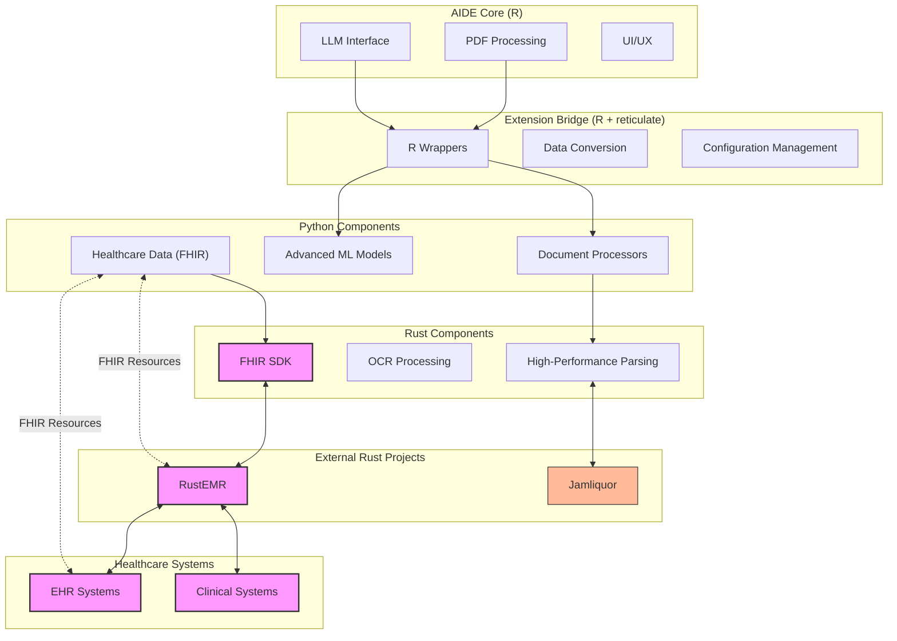

# Architecture

The AIDE-extension uses a modular, language-appropriate architecture designed for flexibility, performance, and robust integration with healthcare data systems. This section details the overall structure, component interactions, and key design patterns.

## Overall Structure

The extension leverages a polyglot approach, combining the strengths of R, Python, and Rust:

- **R (AIDE Core & Bridge):** Manages the user interface (via Shiny in the main AIDE application), orchestrates calls to Python components using `reticulate`, and handles statistical analysis and visualization of results.
- **Python (AI/ML & Healthcare Logic):** Implements advanced document processing, machine learning models for data extraction, and healthcare-specific logic, including FHIR compliance.
- **Rust (High-Performance Tasks):** Provides optimized libraries for computationally intensive tasks like document parsing and OCR acceleration, accessed via Python bindings.

## Component Diagram

The following diagram illustrates the relationships between the core AIDE application, the extension components, and external systems:

The diagram illustrates how components interact across language boundaries and with external healthcare systems. FHIR integration (highlighted in pink) connects data between Python, Rust components (using fhir-sdk), and RustEMR.

## Key Interaction Patterns

1.  **R → Python (via `reticulate`):**
    *   The primary AIDE R application initiates calls to the Python components within the extension.
    *   `reticulate` handles the inter-process communication, data marshalling (converting R data structures to Python and vice-versa), and Python environment management.
    *   This pattern is used for tasks like sending a document to Python for advanced processing or triggering an ML model for entity extraction.

2.  **Python → Rust (via Python Bindings):**
    *   Python components can call Rust functions for tasks requiring high performance or memory safety (e.g., parsing large documents, complex text manipulation).
    *   Libraries like PyO3 or Maturin are used to create Python bindings for Rust code, making Rust functions callable as if they were native Python functions.
    *   This allows leveraging Rust's speed for critical sections without rewriting the entire Python component.

3.  **Shared Data Formats & APIs:**
    *   Components primarily exchange data using standardized formats like JSON for structured data, and common data frame representations.
    *   FHIR resources (typically in JSON or XML format) are used for healthcare data exchange between Python components, RustEMR, and external EHR systems.
    *   Well-defined APIs between components ensure modularity and ease of maintenance.

## Detailed Component Breakdown

*(This section will be further expanded with links to `python_components.md`, `rust_components.md`, and `r_integration.md` for more granular details on each language-specific part of the architecture.)*

### Python Components

*(Brief overview here, detailed in `python_components.md`)*
- Document Processing (pymupdf, Tesseract)
- AI/ML Models (NER, Layout Analysis)
- FHIR Data Handling

### Rust Components

*(Brief overview here, detailed in `rust_components.md`)*
- High-Performance Parsing
- OCR Acceleration
- FHIR SDK (FlixCoder/fhir-sdk integration)

### R Integration Layer

*(Brief overview here, detailed in `r_integration.md`)*
- `reticulate` Bridge
- UI Extensions in AIDE Shiny App
- Configuration and Error Handling

